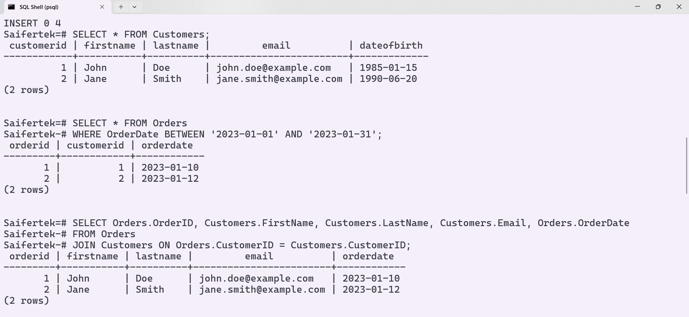
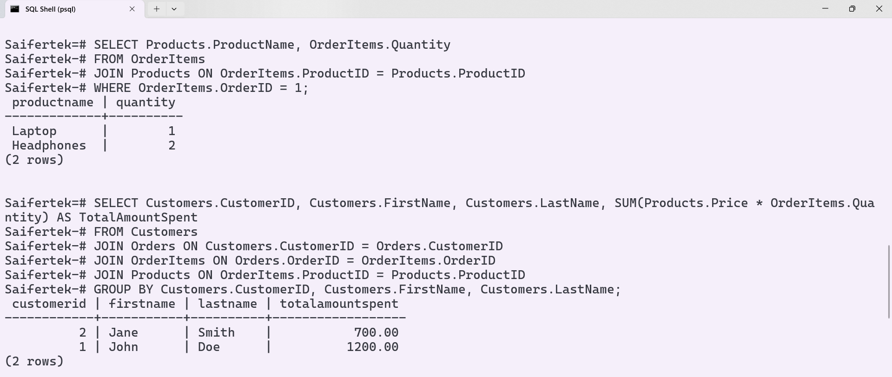
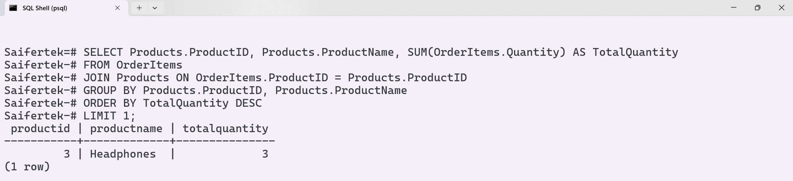
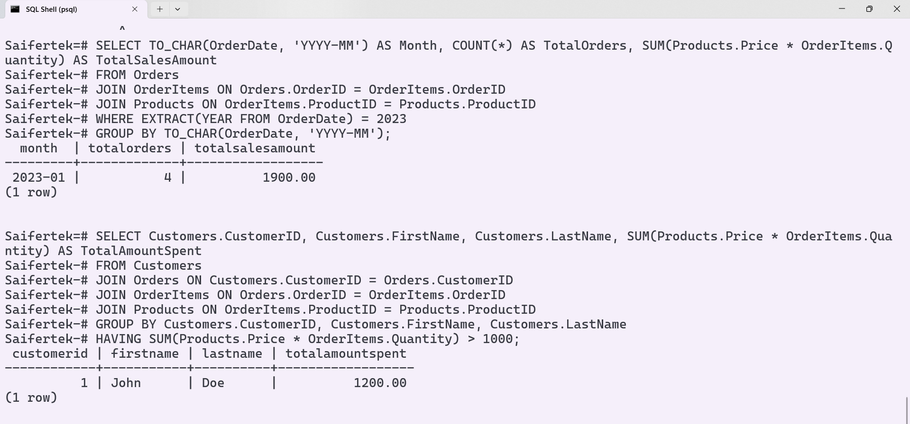

Certainly! Below is a sample `README.md` file that includes instructions, code snippets, and placeholders for screenshots.

```markdown
# Retail Store Database Queries

This repository contains SQL scripts to create a simple retail store database, insert sample data, and perform various queries on the database. The queries cover common operations such as listing customers, finding orders, calculating total amounts spent by customers, and more.

## Table of Contents
1. [Database Setup](#database-setup)
2. [Sample Data](#sample-data)
3. [Queries](#queries)
4. [Outputs](#outputs)

## Database Setup

To create the database tables and insert the sample data, run the following SQL script:

```sql
-- Drop tables if they exist to ensure script can be run multiple times without errors
DROP TABLE IF EXISTS OrderItems;
DROP TABLE IF EXISTS Orders;
DROP TABLE IF EXISTS Products;
DROP TABLE IF EXISTS Customers;

-- Create Customers table
CREATE TABLE Customers (
    CustomerID INT PRIMARY KEY,
    FirstName VARCHAR(50),
    LastName VARCHAR(50),
    Email VARCHAR(100),
    DateOfBirth DATE
);

-- Create Products table
CREATE TABLE Products (
    ProductID INT PRIMARY KEY,
    ProductName VARCHAR(100),
    Price DECIMAL(10, 2)
);

-- Create Orders table
CREATE TABLE Orders (
    OrderID INT PRIMARY KEY,
    CustomerID INT,
    OrderDate DATE,
    FOREIGN KEY (CustomerID) REFERENCES Customers(CustomerID)
);

-- Create OrderItems table
CREATE TABLE OrderItems (
    OrderItemID INT PRIMARY KEY,
    OrderID INT,
    ProductID INT,
    Quantity INT,
    FOREIGN KEY (OrderID) REFERENCES Orders(OrderID),
    FOREIGN KEY (ProductID) REFERENCES Products(ProductID)
);

-- Insert data into Customers table
INSERT INTO Customers (CustomerID, FirstName, LastName, Email, DateOfBirth) VALUES
(1, 'John', 'Doe', 'john.doe@example.com', '1985-01-15'),
(2, 'Jane', 'Smith', 'jane.smith@example.com', '1990-06-20');

-- Insert data into Products table
INSERT INTO Products (ProductID, ProductName, Price) VALUES
(1, 'Laptop', 1000.00),
(2, 'Smartphone', 600.00),
(3, 'Headphones', 100.00);

-- Insert data into Orders table
INSERT INTO Orders (OrderID, CustomerID, OrderDate) VALUES
(1, 1, '2023-01-10'),
(2, 2, '2023-01-12');

-- Insert data into OrderItems table
INSERT INTO OrderItems (OrderItemID, OrderID, ProductID, Quantity) VALUES
(1, 1, 1, 1),
(2, 1, 3, 2),
(3, 2, 2, 1),
(4, 2, 3, 1);
```

## Sample Data

The sample data inserted into the tables is as follows:

### Customers
| CustomerID | FirstName | LastName | Email                  | DateOfBirth |
|------------|-----------|----------|------------------------|-------------|
| 1          | John      | Doe      | john.doe@example.com   | 1985-01-15  |
| 2          | Jane      | Smith    | jane.smith@example.com | 1990-06-20  |

### Products
| ProductID | ProductName | Price |
|-----------|-------------|-------|
| 1         | Laptop      | 1000  |
| 2         | Smartphone  | 600   |
| 3         | Headphones  | 100   |

### Orders
| OrderID | CustomerID | OrderDate   |
|---------|------------|-------------|
| 1       | 1          | 2023-01-10  |
| 2       | 2          | 2023-01-12  |

### OrderItems
| OrderItemID | OrderID | ProductID | Quantity |
|-------------|---------|-----------|----------|
| 1           | 1       | 1         | 1        |
| 2           | 1       | 3         | 2        |
| 3           | 2       | 2         | 1        |
| 4           | 2       | 3         | 1        |

## Queries

Here are the SQL queries to perform various operations on the database:

### 1. List all customers
```sql
SELECT * FROM Customers;
```

### 2. Find all orders placed in January 2023
```sql
SELECT * FROM Orders
WHERE OrderDate BETWEEN '2023-01-01' AND '2023-01-31';
```

### 3. Get the details of each order, including the customer name and email
```sql
SELECT Orders.OrderID, Customers.FirstName, Customers.LastName, Customers.Email, Orders.OrderDate
FROM Orders
JOIN Customers ON Orders.CustomerID = Customers.CustomerID;
```

### 4. List the products purchased in a specific order (e.g., OrderID = 1)
```sql
SELECT Products.ProductName, OrderItems.Quantity
FROM OrderItems
JOIN Products ON OrderItems.ProductID = Products.ProductID
WHERE OrderItems.OrderID = 1;
```

### 5. Calculate the total amount spent by each customer
```sql
SELECT Customers.CustomerID, Customers.FirstName, Customers.LastName, SUM(Products.Price * OrderItems.Quantity) AS TotalAmountSpent
FROM Customers
JOIN Orders ON Customers.CustomerID = Orders.CustomerID
JOIN OrderItems ON Orders.OrderID = OrderItems.OrderID
JOIN Products ON OrderItems.ProductID = Products.ProductID
GROUP BY Customers.CustomerID, Customers.FirstName, Customers.LastName;
```

### 6. Find the most popular product (the one that has been ordered the most)
```sql
SELECT Products.ProductID, Products.ProductName, SUM(OrderItems.Quantity) AS TotalQuantity
FROM OrderItems
JOIN Products ON OrderItems.ProductID = Products.ProductID
GROUP BY Products.ProductID, Products.ProductName
ORDER BY TotalQuantity DESC
LIMIT 1;
```

### 7. Get the total number of orders and the total sales amount for each month in 2023
```sql
SELECT TO_CHAR(OrderDate, 'YYYY-MM') AS Month, COUNT(*) AS TotalOrders, SUM(Products.Price * OrderItems.Quantity) AS TotalSalesAmount
FROM Orders
JOIN OrderItems ON Orders.OrderID = OrderItems.OrderID
JOIN Products ON OrderItems.ProductID = Products.ProductID
WHERE EXTRACT(YEAR FROM OrderDate) = 2023
GROUP BY TO_CHAR(OrderDate, 'YYYY-MM');
```

### 8. Find customers who have spent more than $1000
```sql
SELECT Customers.CustomerID, Customers.FirstName, Customers.LastName, SUM(Products.Price * OrderItems.Quantity) AS TotalAmountSpent
FROM Customers
JOIN Orders ON Customers.CustomerID = Orders.CustomerID
JOIN OrderItems ON Orders.OrderID = OrderItems.OrderID
JOIN Products ON OrderItems.ProductID = Products.ProductID
GROUP BY Customers.CustomerID, Customers.FirstName, Customers.LastName
HAVING SUM(Products.Price * OrderItems.Quantity) > 1000;
```

## Outputs

Below are the outputs for each query:

### 1. List all customers


### 2. Find all orders placed in January 2023


### 3. Get the details of each order, including the customer name and email


### 4. List the products purchased in a specific order (e.g., OrderID = 1)


### 5. Calculate the total amount spent by each customer


### 6. Find the most popular product (the one that has been ordered the most)


### 7. Get the total number of orders and the total sales amount for each month in 2023


### 8. Find customers who have spent more than $1000


